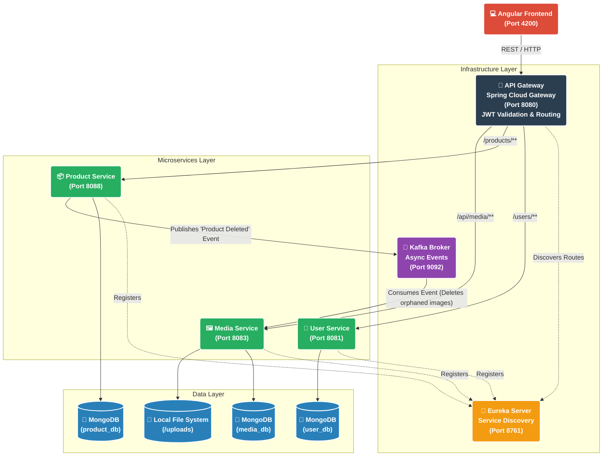

# 🛒 Buy-01 — Full-Stack E-Commerce Platform

A modern, event-driven e-commerce marketplace built with **Spring Boot microservices**, **Angular**, **MongoDB**, and **Apache Kafka**. Users register as **clients** (browse products) or **sellers** (manage catalogs and media). The architecture emphasizes clean service boundaries, asynchronous communication, and secure file handling.

---

## 🏗️ Architecture Overview



### Services

| Service | Port | Responsibility |
|---------|------|----------------|
| **Discovery Server** | `8761` | Netflix Eureka registry — all services register here for dynamic routing |
| **API Gateway** | `8080` | Single entry point — JWT validation, CORS, reverse proxy to microservices |
| **User Service** | `8081` | Auth (register/login), JWT generation, profile management |
| **Product Service** | `8088` | Product CRUD, ownership checks, publishes Kafka events on deletion |
| **Media Service** | `8083` | Image upload/download, deep file sniffing, **no DELETE endpoint** — cleanup via Kafka only |

---

## 🛠️ Tech Stack

| Layer | Technology |
|-------|------------|
| **Backend** | Java 21, Spring Boot 3.3.6, Spring Cloud Gateway, Netflix Eureka |
| **Frontend** | Angular, Angular Material |
| **Databases** | MongoDB (per service), Local File System (image storage) |
| **Message Broker** | Apache Kafka + Zookeeper |
| **Security** | Spring Security, Stateless JWT |
| **Docs** | Springdoc OpenAPI (Swagger UI) |
| **DevOps** | Docker, Docker Compose |

---

## 🚀 Getting Started

### Prerequisites

- **Java 21**
- **Maven** (or use the bundled `./mvnw`)
- **Node.js** (for Angular frontend)
- **Docker & Docker Compose**

### 1. Start Infrastructure (Databases & Kafka)

```bash
docker compose up -d
```

This starts:
- MongoDB + Mongo Express
- Zookeeper + Kafka

### 2. Start the Backend

**First time** (clean build everything):

```bash
chmod +x start.sh
./start.sh
```

**After first time** (faster, incremental builds):

```bash
chmod +x run.sh
./run.sh
```

> Both scripts start all 5 services in the correct order (Eureka first, then the rest) and stream logs to `logs/`.

### 3. Start the Frontend

```bash
cd frontend
npm install
ng serve
```

The Angular app will be available at **http://localhost:4200**.

---

## 🔗 Quick Links

| Resource | URL |
|----------|-----|
| **Angular App** | http://localhost:4200 |
| **Eureka Dashboard** | http://localhost:8761 |
| **Central Swagger UI** | http://localhost:8080/swagger-ui.html |
| **Mongo Express** | http://localhost:8081 (if enabled in docker-compose) |

> Use the **"Select a definition"** dropdown in Swagger UI to switch between User, Product, and Media service docs.

---

## 📖 API Documentation

We use a **Centralized Swagger Hub** — no need to visit each microservice individually.

Once all services are running, navigate to:
👉 **http://localhost:8080/swagger-ui.html**

---

## ⚡ Event-Driven Design Highlight

The **Media Service has no `DELETE` REST endpoint** by design. When a seller deletes a product:

1. **Product Service** deletes the DB record and publishes the `mediaId` to Kafka (`product-deletion-topic`), returning `204 No Content` immediately.
2. **Media Service** consumes the event in the background and safely deletes the physical file.

**Benefits:**
- ⚡ Lightning-fast API responses
- 🔒 Secure — media cannot be deleted via external REST manipulation
- 🔄 Resilient — if Media Service is down, the event queues and processes later

---

## 🗂️ Project Structure

```
buy-01/
├── backend/
│   ├── discovery-server/     # Eureka Service Registry
│   ├── api-gateway/          # Spring Cloud Gateway
│   ├── user-service/         # Auth & Profiles
│   ├── product-service/      # Product CRUD & Kafka Producer
│   └── media-service/        # File Storage & Kafka Consumer
├── frontend/                 # Angular SPA
├── docker-compose.yml        # MongoDB, Kafka, Zookeeper
├── start.sh                  # First-time build & run
├── run.sh                    # Quick run (incremental)
├── logs/                     # Service logs (auto-created)
└── README.md                 # This file
```

---

## 🛑 Stopping the Application

- **If running via `start.sh` or `run.sh`:** Press `Ctrl+C` — the trap handler kills all Java processes cleanly.
- **To shut down Docker infrastructure:**

```bash
docker compose down
```

---

## 📋 Evaluation Checklist

| Criterion | Status |
|-----------|--------|
| ⚙️ 3+ Microservices with clean boundaries | ✅ User, Product, Media |
| 🔐 JWT Auth + Role-based access (CLIENT / SELLER) | ✅ |
| 📨 Async communication via Kafka | ✅ Product deletion events |
| 🍃 MongoDB per service | ✅ |
| 🖼️ Secure media upload (type sniffing, 2MB limit) | ✅ |
| 🧪 Health checks (`/actuator/health`) | ✅ |
| 📖 Centralized API docs | ✅ Swagger Hub |
| 🎨 Angular SPA with guards & interceptors | ✅ |

---
